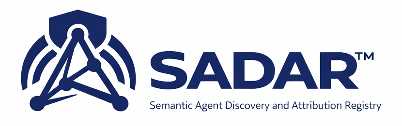

<p align="center">
  
</p>

<h1 align="center">SADAR Specification</h1>

<p align="center">
  <strong>Semantic Agent Discovery and Attribution</strong><br/>
  An open, community-governed specification for semantic discovery, capability attribution, and governed invocation of agents, tools, and services
</p>

<p align="center">
  
  
  
</p>

---

## Usage Note

The documentation within this repository represents **work in progress**.  As such, it is **subject to material changes, additions, deletions, etc.**.
---

## Overview

**Semantic Agent Discovery and Attribution (SADAR™)** is a community-governed specification that defines how agents, tools, and services are:

- **Discovered** based on industry-defined capabilities, data semantics, and non-functional requirements
- **Attributed** so that every invocation carries verified, traceable identity across the full call chain
- **Invoked** deterministically within an industry-defined business process, with cross-agent and cross-environment attribution preserved end-to-end

### The Attribution Model

SADAR closes the *agent attribution gap* — the inability to know definitively *who* invoked *what*, *on whose behalf*, and *within which process context*. Attribution is established across four complementary mechanisms:

| Mechanism | What It Establishes |
|---|---|
| **OIDC authentication** | Concrete identity of both the requesting and serving agent |
| **mTLS channel binding** | Authenticated endpoints — the channel itself is verified, not just the token |
| **Publisher-signed manifests** | Integrity of capability declarations — manifests cannot be silently altered |
| **OIDC claim extension** | Originator identity propagated through the full invocation chain |

> SADAR defines *how attribution is established and carried*. Authorization policy — what any system does with that attributed identity — is outside the scope of this specification and left to implementors.

SADAR moves from agents probabilistically deciding what, when, and how to invoke other agents, tools, and resources to a **deterministic** process grounded in existing industry process, task, and data definitions.

For value proposition, use cases, and adoption guidance, visit **[opensemantics.org/sadar](https://opensemantics.org/sadar)**.

---

## Core Dimensions

SADAR defines interoperability across three primary dimensions:

### 🔹 Intent
Structured representation of business and technical intent, aligned to industry and domain standards
(e.g., industry → process → task → operation/document, grounded in NAICS, APQC PCF, O*NET)

### 🔹 Semantics
Shared meaning of data and interactions using standard vocabularies and schemas
(e.g., HL7, X12, ISO 20022, schema.org, domain-specific models)

### 🔹 Non-Functional Requirements (NFRs)
Constraints and expectations governing agent selection and execution, including:

- Security and compliance (e.g., SOC 2, HIPAA, FedRAMP)
- Operational characteristics (e.g., latency, availability, SLA)
- Commercial terms (e.g., pricing model, rate limits)

---

## Repository Structure

```plaintext
/
├── spec/
│   ├── sadar-core-v0.9.md          # Normative specification text
│   ├── manifest-schema.json         # Agent/service manifest JSON schema
│   └── sct-schema.json              # Attribution token schema
├── docs/
│   ├── images/
│   │   └── SADAR_Logo.png
│   ├── 0_CS_Contributor_License_Agreement.md
│   ├── 1_Community_Specification_License-v1.md
│   ├── 2_Scope.md
│   ├── 3_Notices.md
│   ├── 4_License.md
│   ├── 5_Governance.md
│   ├── 6_Contributing.md
│   └── 7_CS_Template.md
├── TRADEMARKS.md
└── README.md
└── EXCLUSIONS.md
```

---

## Implementations

*The Official SADAR Reference App is currently in development.*

| Name | Organization | Type | Status |
|---|---|---|---|


*To list your implementation, open a pull request updating this table.*

---

## Where to Start

| Goal | Resource |
|---|---|
| Understand the value proposition | [opensemantics.org/sadar](https://opensemantics.org/sadar) |
| Contribute to the specification | [`CONTRIBUTING.md`](./docs/6_Contributing.md) |
| Review governance | [`GOVERNANCE.md`](./docs/5_Governance.md) |
| Trademark usage | [`TRADEMARKS.md`](./TRADEMARKS.md) |
| Patent/IP Exclusions | [`EXCLUSIONS.md`](./EXCLUSIONS.md) |

---

## Ecosystem Alignment

SADAR is designed to complement, not replace, existing agent ecosystem standards:

- **MCP (Model Context Protocol)** — SADAR provides semantic discovery and attribution on top of MCP tool invocation
- **A2A (Agent-to-Agent Protocol)** — SADAR manifest and attribution patterns extend A2A for enterprise governance contexts
- **OIDC / mTLS** — SADAR leverages existing identity infrastructure rather than defining new identity mechanisms

---

## Community and Governance

SADAR is governed as a community specification under the [Community Specification License 1.0](./docs/1_Community_Specification_License-v1.md). Contributions are welcome subject to the [Contributor License Agreement](./docs/0_CS_Contributor_License_Agreement.md).

The specification is stewarded by **[OpenSemantics.org](https://opensemantics.org)**, an initiative of Cognita AI Inc., with the goal of open, vendor-neutral governance.

---

## License and Trademark

© 2026 Cognita AI Inc. Licensed under the [Community Specification License 1.0](./docs/1_Community_Specification_License-v1.md).

SADAR™ is a trademark of Cognita AI Inc. See [TRADEMARKS.md](./TRADEMARKS.md) for permitted and prohibited uses.
